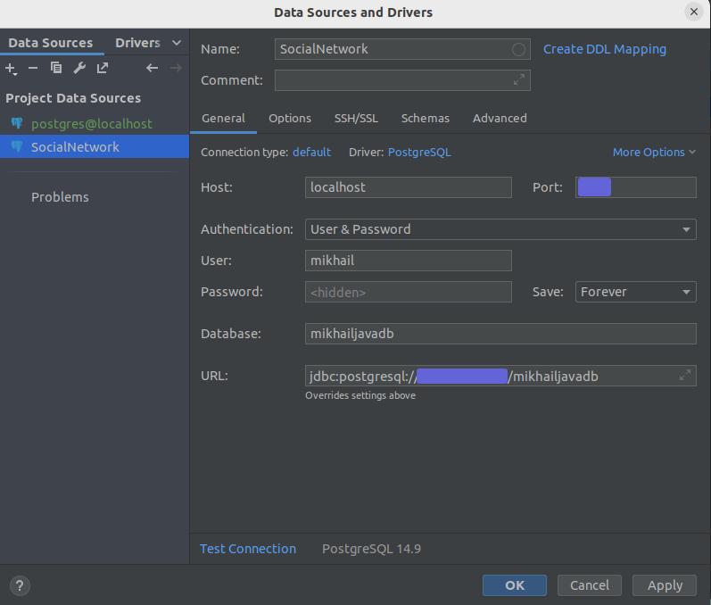
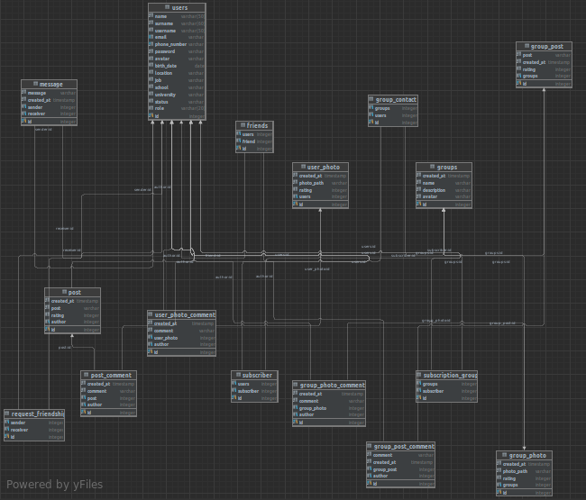

# 🗃️ База данных (Database)

Чтобы подключить базу данных, нужно 
выполнить следующие действия:
1. **Скачать установщик PostgreSQL**.
Ссылка для скачивания: 
[PostgreSQL Database Download](https://www.enterprisedb.com/downloads/postgres-postgresql-downloads).
2. **Установить PostgreSQL**.
Полный процесс установки описывать не буду, поскольку он может отличаться 
в зависимости от Вашей ОС.

Во время установки PostgreSQL создайте новую роль, поскольку у Вас может быть много баз данных и много программ, 
которые их используют. Придумайте пароль, подтвердите его 2 раза.
3. **Создать базу данных**. 
База данных создается SQL-командой **CREATE DATABASE**:
```sql
CREATE DATABASE <name>;
```
**_name_** подчиняется правилам именования идентификаторов SQL.

4. **Отредактировать application.properties**
Измените следующие параметры, указав свои данные:
```properties
spring.datasource.url=your_JDBC_URL
spring.datasource.username=your_name
spring.datasource.password=your_password
```
5. **Подключить PostgreSQL к проекту IntelliJ IDEA**.
Работаю с БД, используя IntelliJ IDEA, поэтому решил добавить 
данный пункт. Вы можете использовать, например, pgAdmin. 

Чтобы подключиться к базе данных, создайте источник данных (Data Source), 
в котором будут храниться данные о вашем подключении. Затем заполните
поля, представленные на скриншоте:



После этого убедитесь, что соединение с базой данных успешно установлено.
Чтобы сделать это, нажмите на кнопку **_Test Connection_**.
Если все хорошо, нажмите ОК.

6. **Добавить таблицы в базу данных**.
Структура таблиц представлена в [Database_FriendLove.txt](Database_FriendLove.txt).
Выполнив команды SQL, Вы добавите таблицы.

# 📝 Схема базы данных (Database schema)



<details>
<summary>English version</summary>

To connect the database, follow these steps:
1. **Download the PostgreSQL installer.**
2. **Install PostgreSQL.**

I will not describe the full installation process, as it may differ
depending on your operating system.

During the PostgreSQL installation, create a new role, as you may have many databases and many programs
that use them. Come up with a password, confirm it 2 times.
3. **Create a database.**
   The database is created by the SQL command **CREATE DATABASE**:
```sql
CREATE DATABASE <name>;
```
**_name_** obeys the SQL identifier naming rules.
4. **Edit application.properties.**
Change the following parameters by specifying your data:
```properties
spring.datasource.url=your_JDBC_URL
spring.datasource.username=your_name
spring.datasource.password=your_password
```
5. **Connect PostgreSQL to the IntelliJ IDEA project.**

I work with a database using IntelliJ IDEA, so I decided to add
this item. You can use, for example, pgAdmin.

To connect to the database, create a Data Source
in which data about your connection will be stored. Then fill
in the fields shown in the screenshot ([image](images/data_source.png)).

After that, make sure that the connection to the database is successfully established.
To do this, click on the **_Test Connection_** button.
If everything is fine, click OK.
6. **Add tables to the database**.
   The structure of the tables is presented in [Database_FriendLove.txt](Database_FriendLove.txt).
   By executing SQL commands, you will add tables.
</details>