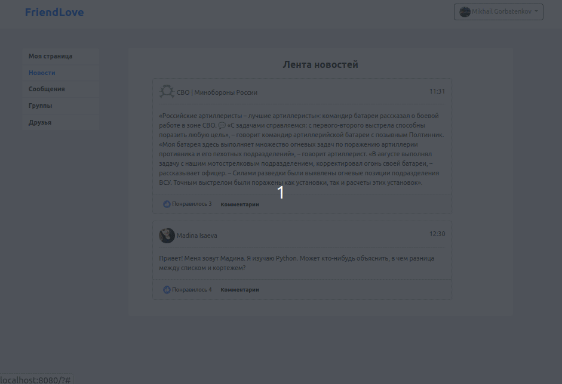
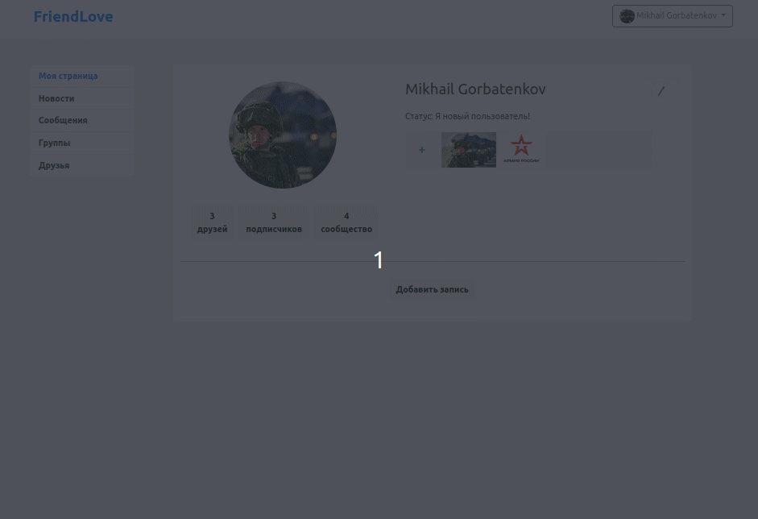
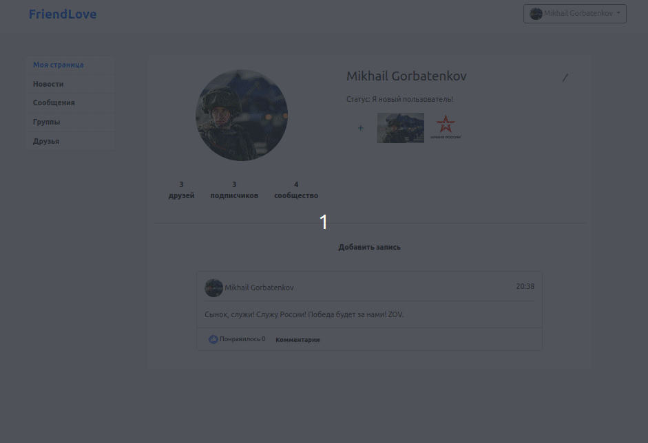
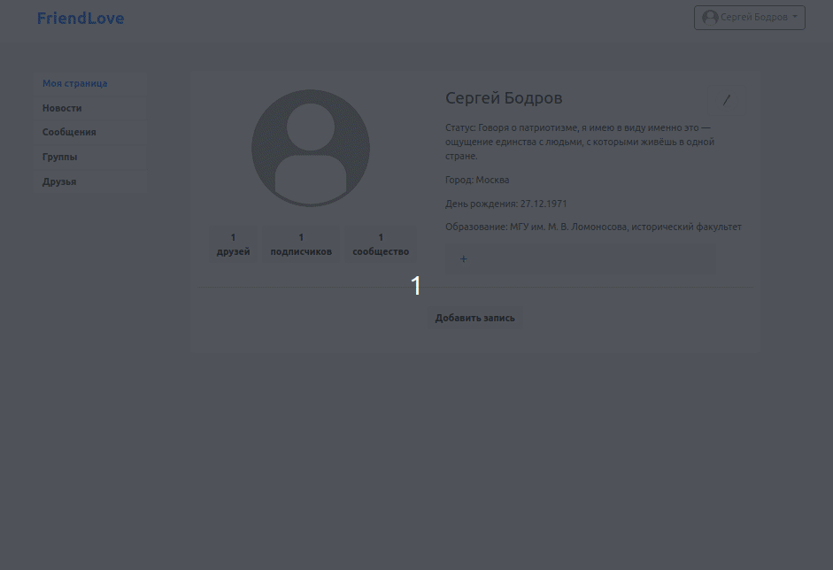
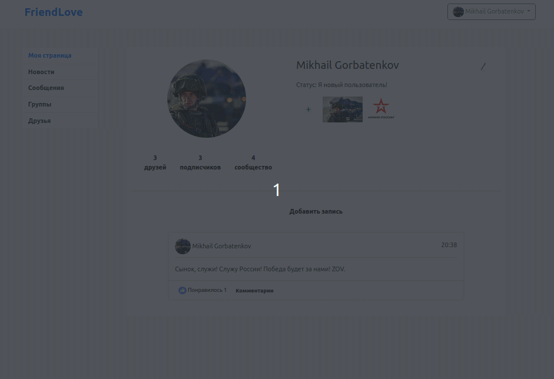

# 🎥 Демонстрация приложения

Наше знакомство с социальной сетью начинается с регистрации.
Как только Вы будете зарегистрированы, Вам будет доступен весь функционал FriendLove.

## 🔐 Регистрация и авторизация

На странице регистрации потребуется заполнить следующие поля:

* имя, фамилия;
* номер телефона;
* пароль.

Пройдя этап регистрации, Вы сможете войти в систему.

Авторизация в социальной сети FriendLove продемонстрирована ниже.

## 😎 Личная страница пользователя

После авторизации, Вам будут доступны следующие веб-страницы:

* моя страница;
* новости;
* сообщения;
* группы;
* друзья.

Что касается личной страницы пользователя, то она представлена ниже.

Открыв страницу профиля, пользователь имеет следующие возможности:

* Возможность добавить личную информацию (город, день рождения, место работы и др.);
* Возможность добавить фотографии, установить аватарку;
* Возможность добавить публикации (посты).

Чтобы установить аватарку, необходимо нажать соответствующую кнопку.
Для добавления публикации следует нажать _**"Добавить запись"**_ (см. GIF-анимацию).

## 💬 Общение с друзьями

Чтобы общаться с друзьями, откройте страницу **_"Сообщения"_**.
Вам будут доступны переписки, а также предоставлена возможность отправлять личные сообщения.
Общение с другом показано ниже.

## 🔍 Поиск друзей

Чтобы найти друзей, выполните следующее:

1. Откройте страницу **_"Друзья"_**.
2. Введите имя и (или) фамилию друга. Если пользователь зарегистрирован в соцсети, 
система его найдет.
3. Отправьте заявку в друзья.
4. Дождитесь, пока пользователь добавит Вас в друзья.

Предлагаю ознакомиться с GIF-анимацией, которая демонстрирует данный процесс.

## 👥 Группы
Чтобы просмотреть сообщества, выполните следующее:
1. Откройте страницу **_"Группы"_**.
2. Если список сообществ пуст, добавьте группу, нажав на соответствующую кнопку.
Если интересующая Вас группа присутствует, нажмите на нее, чтобы подписаться и (или) ознакомиться 
с публикациями сообщества.

Более детальная информация показана ниже.

