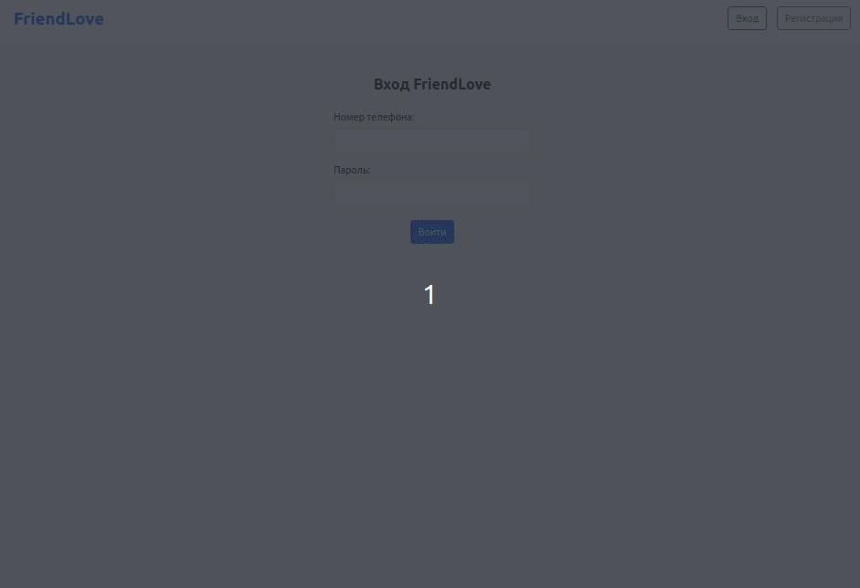
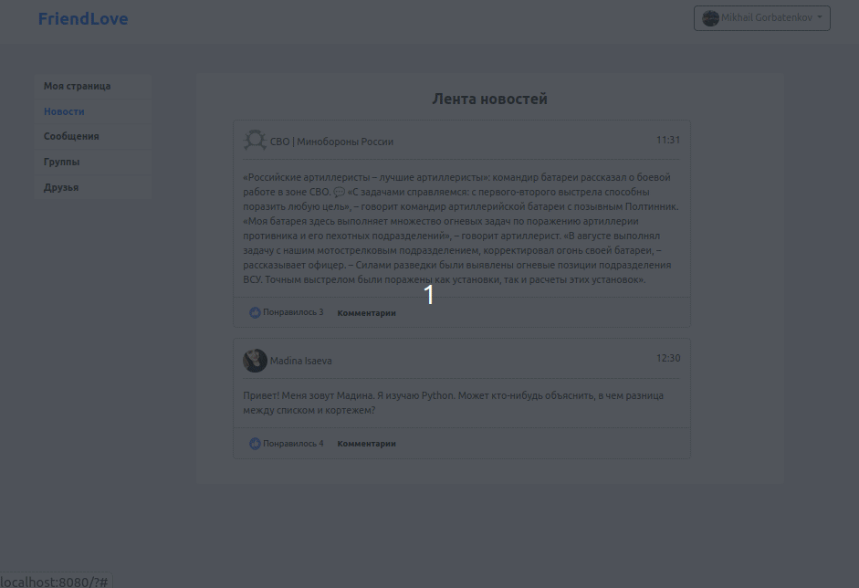
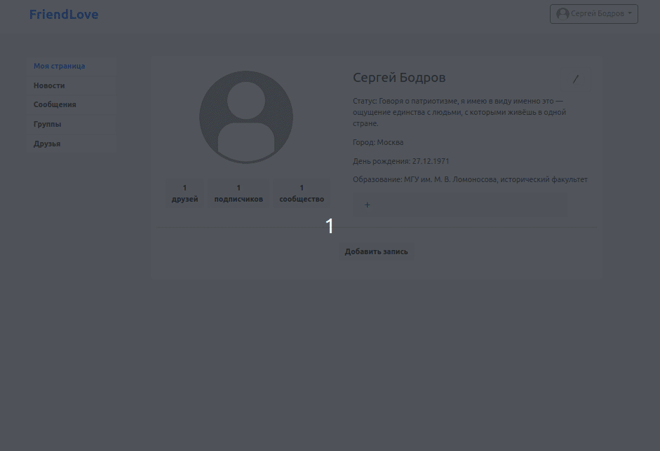

# 🎥 Демонстрация приложения (Demonstration of the application)

Наше знакомство с социальной сетью начинается с регистрации.
Как только Вы будете зарегистрированы, Вам будет доступен весь функционал FriendLove.

English version

Our acquaintance with the social network begins with registration.
As soon as you register, all the features of **FriendLove** will be available to you.

## 🔐 Регистрация и авторизация (Registration and authorization)

На странице регистрации потребуется заполнить следующие поля:

* имя, фамилия;
* номер телефона;
* пароль.

Пройдя этап регистрации, Вы сможете войти в систему.

Авторизация в социальной сети FriendLove продемонстрирована ниже.

English version

On the registration page, you will need to fill in the following fields:

* first name, last name;
* phone number;
* password.

After completing the registration stage, you will be able to log in.

Authorization in the Friend Love social network is demonstrated using animation.

## 😎 Личная страница пользователя (User's personal page)

После авторизации, Вам будут доступны следующие веб-страницы:

* моя страница;
* новости;
* сообщения;
* группы;
* друзья.

Что касается личной страницы пользователя, то она представлена ниже.

Открыв страницу профиля, пользователь имеет следующие возможности:

* Возможность добавить личную информацию (город, день рождения, место работы и др.);
* Возможность добавить фотографии, установить аватарку;
* Возможность добавить публикации (посты).

Чтобы установить аватарку, необходимо нажать соответствующую кнопку.
Для добавления публикации следует нажать _**"Добавить запись"**_ (см. GIF-анимацию).

English version

After authorization, the following web pages will be available to you:

* my page;
* news;
* messages;
* groups;
* friends.

As for the user's personal page, it is presented in the form of a GIF animation.

By opening the profile page, the user has the following features:

* The ability to add personal information (city, birthday, place of work, etc.);
* The ability to add photos, set an avatar;
* Ability to add publications (posts).

To install an avatar, you need to click the appropriate button.
To add a post, click _**"Add entry"**_ (see GIF animation).

## 💬 Общение с друзьями (Communication with friends)

Чтобы общаться с друзьями, откройте страницу **_"Сообщения"_**.
Вам будут доступны переписки, а также предоставлена возможность отправлять личные сообщения.
Общение с другом показано ниже.

English version

To chat with friends, open the page **_"Messages"_**.
Correspondence will be available to you, as well as the opportunity to send private messages.
Communication with a friend is shown as a Gif animation.

## 🔍 Поиск друзей (Search for friends)

Чтобы найти друзей, выполните следующее:

1. Откройте страницу **_"Друзья"_**.
2. Введите имя и (или) фамилию друга. Если пользователь зарегистрирован в соцсети, 
система его найдет.
3. Отправьте заявку в друзья.
4. Дождитесь, пока пользователь добавит Вас в друзья.

Предлагаю ознакомиться с GIF-анимацией, которая демонстрирует данный процесс.

English version

To find friends, follow these steps:

1. Open the page **_"Friends"_**.
2. Enter your friend's first and/or last name. If the user is registered in a social network,
   the system will find him.
3. Send a request to friends.
4. Wait for the user to add you as a friend.

I suggest you familiarize yourself with the GIF animation that demonstrates this process.

## 👥 Группы (Groups)
Чтобы просмотреть сообщества, выполните следующее:
1. Откройте страницу **_"Группы"_**.
2. Если список сообществ пуст, добавьте группу, нажав на соответствующую кнопку.
Если интересующая Вас группа присутствует, нажмите на нее, чтобы подписаться и (или) ознакомиться 
с публикациями сообщества.

Более детальная информация показана ниже.

English version

To view communities, follow these steps:
1. Open the page **_"Groups"_**.
2. If the list of communities is empty, add a group by clicking on the corresponding button.
If the group you are interested in is present, click on it to subscribe and/or read
the community publications.

For more information, see the gif animation.

